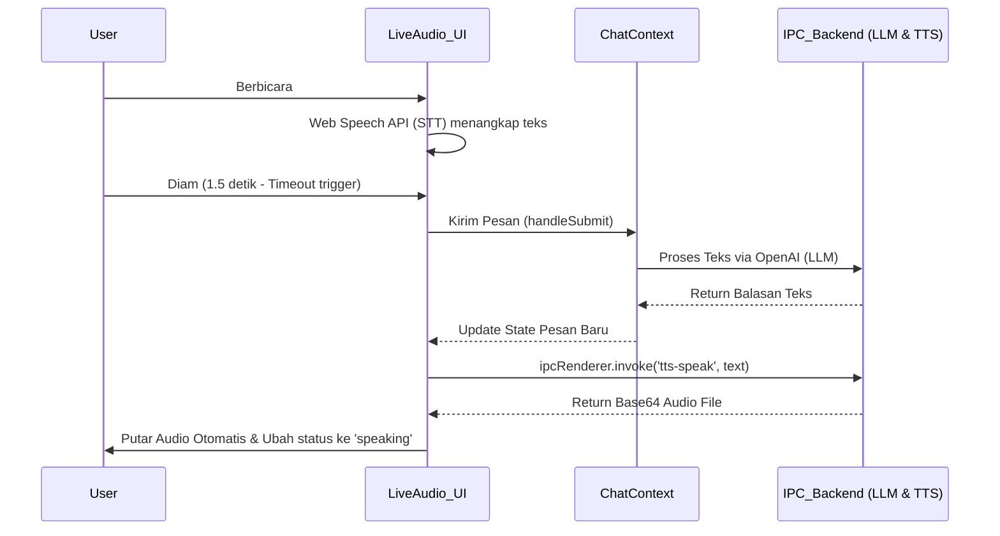

# Software Requirements Specification (SRS) - Update Plan
## Aplikasi "Mark" AI Voice Agent (Electron & React)

---

## 1. Pendahuluan

### 1.1 Tujuan
Dokumen ini merupakan pembaruan (update) dari perencanaan sistem untuk aplikasi **"Mark"**, sebuah AI Voice Agent berbasis Electron. Tujuan dari dokumen ini adalah untuk menganalisis struktur kode yang sudah ada, mengidentifikasi celah fungsionalitas pada fitur interaksi suara, dan merencanakan integrasi penuh antara antarmuka suara (*Live Audio*) dengan sistem pemrosesan LLM dan TTS (*Text-to-Speech*) yang sudah berjalan.

### 1.2 Ruang Lingkup Pembaruan
Fokus utama pembaruan ada pada komponen `LiveAudio.jsx` (Frontend) dan integrasinya dengan *ChatContext* (State Management) serta backend IPC (Electron). Saat ini antarmuka dan penangkapan suara dasar (*Speech-to-Text* lokal browser) sudah ada, namun belum secara mulus meneruskan *input* tersebut ke LLM dan mengeluarkan balasan berupa suara secara otomatis.

---

## 2. Analisis Kondisi Proyek Saat Ini (Existing State)

Berdasarkan struktur kode `mark-project`:

### 2.1 Arsitektur Saat Ini
- **Framework Utama**: Electron dengan React.js (Vite) dan TailwindCSS (DaisyUI).
- **Frontend (`src/renderer`)**:
  - Memiliki sistem *Routing* (`Chat`, `Configuration`, `LiveAudio`).
  - `LiveAudio.jsx`: Sudah mengimplementasikan antarmuka visual yang sangat baik dengan animasi *pulsing* (*audio-glow* dll). Menggunakan `window.SpeechRecognition` (Web Speech API) untuk *Speech-to-Text* (STT) secara *real-time*.
  - *State Management*: `ChatContext` mengelola riwayat *chat*, *loading state*, dan fungsi `handleSubmit`.
- **Backend (`src/main/index.js`)**:
  - Sudah memiliki berbagai *handler* IPC yang canggih: `tts-speak` (menggunakan `msedge-tts`), `get-youtube-transcript`, `youtube-search`, `search-music` (`ytmusic-api`), dan fungsi eksekusi *node task*.

### 2.2 Celah (Gap) yang Perlu Diperbaiki
Pada file `LiveAudio.jsx`, ketika pengguna selesai berbicara, skrip menangkap `finalTranscript`, menyimpannya ke *state* `setMessage`, namun prosesnya berhenti sampai di situ.
```javascript
// Baris 56-57 di LiveAudio.jsx
setMessage(finalTranscript || interimTranscript)
timeoutsRef.current = setTimeout(() => {}, 1500) // Kosong, tidak melakukan aksi lanjutan
```
Seharusnya, setelah ada hening sementara (*silence* / timeout), sistem otomatis men-*trigger* pengiriman pesan (mirip `handleSubmit`), menunggu balasan LLM (OpenAI dll), dan memutar balasan tersebut menggunakan modul `tts-speak` dari backend.

---

## 3. Fitur yang Akan Diperbarui (System Updates)

### 3.1 Integrasi STT -> LLM secara Otomatis
- **Deskripsi**: Mengubah *trigger* dari yang sebelumnya pasif menjadi aktif. Setelah pengguna diam selama 1.5 detik, teks otomatis dikirim ke backend/LLM.
- **Teknis**: Memperbarui `setTimeout` di dalam `LiveAudio.jsx` agar memanggil fungsi pengiriman (seperti `handleSubmit` dari context).

### 3.2 Pemutaran Audio Otomatis (Auto-TTS) di Mode Live
- **Deskripsi**: Ketika berada di halaman *LiveAudio*, setiap balasan dari *Mark* harus langsung dikonversi menjadi suara dan diputar tanpa perlu menekan tombol "Play" secara manual.
- **Teknis**: Menambahkan pemantauan state balasan di `LiveAudio.jsx` (atau di `ChatContext`). Jika ada pesan baru dari asisten (Mark), ambil teksnya -> panggil `ipcRenderer.invoke('tts-speak', text)` -> putar `base64Audio` yang direturn menggunakan `<audio>` HTML5.

### 3.3 Penanganan Status Visual (UI Status Sync)
- **Deskripsi**: UI saat ini memiliki status 'idle', 'listening', dan 'speaking'. Perlu sinkronisasi ketat.
- **Mekanisme**:
  - Saat mic aktif: `listening`.
  - Saat pesan sedang dikirim ke LLM: Transisi status (misal: 'thinking').
  - Saat audio TTS sedang diputar: status berubah menjadi `speaking` (animasi UI `audio-glow-speaking`).
  - Saat audio TTS selesai: kembali ke `listening`.

### 3.4 Interruption Handling (Barge-in) Sederhana
- **Deskripsi**: Memungkinkan pengguna memotong pembicaraan Mark.
- **Teknis**: Jika *SpeechRecognition* mendeteksi suara pengguna (`onresult` tertrigger) SAAT audio balasan TTS sedang diputar, sistem langsung men-`pause()` dan me-`reset` pemutar audio TTS tersebut, lalu kembali mendengarkan pengguna.

---

## 4. Alur Kerja (Workflow) Interaksi Suara yang Baru



---

## 5. Fase Implementasi Pembaruan (Action Plan)

1. **Fase 1: Koreksi Trigger STT**
   - Modifikasi `LiveAudio.jsx` pada bagian `onresult`. Isi `setTimeout` 1.5 detik dengan logika: hentikan `recognition`, jalankan `handleSubmit` (atau fungsi spesifik untuk mengirim teks ke bot).
   
2. **Fase 2: Playback TTS Otomatis**
   - Gunakan `useEffect` di `LiveAudio.jsx` yang memantau perubahan pada `chatData` terakhir.
   - Jika pesan terakhir berasal dari *Mark* (bot), panggil modul TTS dari backend.
   - Buat objek `Audio()` di JS untuk memutar data Base64.
   
3. **Fase 3: State Sync UI (Mendengarkan & Berbicara)**
   - Saat `Audio()` sedang di-*play*, *set state* UI menjadi `'speaking'`.
   - Gunakan event listener `onended` pada objek `Audio()` untuk mengubah *state* UI kembali ke `'listening'` dan me-*restart* `recognition.start()` jika mode Live masih aktif.
   
4. **Fase 4: Uji Coba & Refine**
   - Memastikan tidak ada *infinite loop* (bot mendengar suaranya sendiri jika tidak pakai *headset*).
   - Pastikan *error handling* jika koneksi API terputus.
